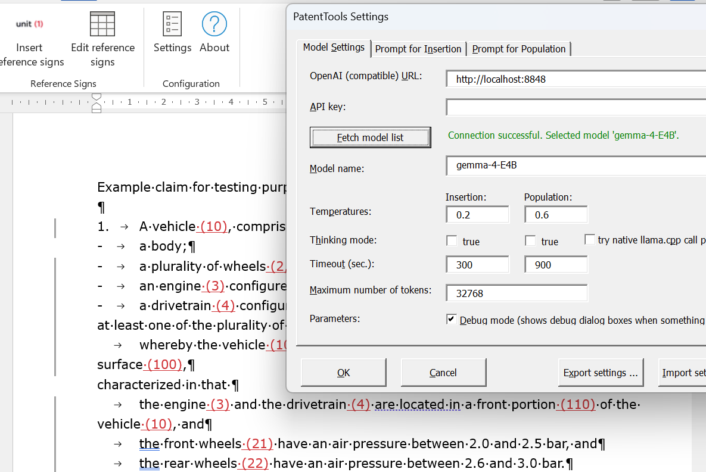

# Patent Tools for Microsoft Word v. 0.2.1

See [CHANGELOG.md](CHANGELOG.md) for release history.

Patent Tools is a Microsoft Word `.dotm` add-in for connecting Microsoft Word to a locally or remotely deployed OpenAI compatible OpenAI-compatible language model endpoint and using the model to perform certain tasks that repeatedly occur in patent attorney practice.

At the present time, Patent Tools supports auto-generation and editing of reference sign lists and smart insertion of the reference signs into claim text. Unlike existing solutions, it supports any language supported by the model and will happily deal with inflected languages such as German, Ukrainian and others, as well as with difficult cases where reference signs depend on context. It is packaged as a self-contained Word template add-in with a custom Ribbon tab.

Flexible programmatic checks make sure that any model hallucinations, omissions or additions other than reference signs are not carried over into the claim set while still picking up on the reference signs. All changes applied to the claim set, i.e. the reference signs inserted, are marked up in track changes mode so you can be sure the model does not modify the claims in any unintended way.

This add-in has been validated to work reasonably well and fast in English as well as non-English languages with sufficiently smart edge models. The target hardware are unified memory systems such as DGX Spark, AMD Strix Halo or a Mac Ultra, or systems with RTX5090 or similar having at least 24 GB VRAM. Also, Patent Tools can be connected to a public or private cloud-based service that provides OpenAI compatible API endpoints.

Further features may be added in the future.



## Installation

To make the Ribbon and macros available in all Word windows, the `.dotm` must be installed as a **global Word add-in**, not merely opened like a normal template. Word automatically loads `.dotm` templates placed in the Word **Startup** folder at launch.

### Manual installation

1. Close all Word windows.
2. Locate Word’s Startup folder.
3. Copy `PatentTools.dotm` into that folder.
4. Reopen Word.
5. Confirm that a **Patent Tools** tab appears in the Ribbon when you open a Word document.

A common Startup path on Windows is:

```
C:\Users\<YourUserName>\AppData\Roaming\Microsoft\Word\STARTUP
```

The exact folder can be checked in Word under:

```
File -> Options -> Advanced -> General -> File Locations -> Startup
```

If the file was downloaded from the internet, Windows may block it. In that case:

1. Right-click `PatentTools.dotm`.
2. Choose **Properties**.
3. If shown, click **Unblock**.
4. Click **Apply** and **OK**.

## How to use

1. Open a document you would like to work with in Word.

2. Open the **Patent Tools** tab.

3. Click **Settings** and configure the endpoint.

4. Click **Edit reference signs**** and paste your reference sign list, or click on **Populate** to have the model auto-generate a reference sign list and edit the model output. 

   Note that you can put any arbitrary instructions to the model below the reference sign list, these will be considered during reference sign insertion.

   When finished, close the dialog with **OK**.

5. Select the relevant claim text in your currently open document, or leave nothing selected to process the full document (not recommended)

6. Click **Insert reference signs** in the Patent Tools ribbon.

7. Paste the previously prepared reference sign table into the dialog. **Please note**: If you use a smart model, you may also add any special prompts in difficult cases where the model should pay attention on how to do things the way you want.

8. The status bar (windows button shows elapsed time to indicate work in progress).

9. Review the inserted changes in Track Changes mode.

## Settings dialog

The settings dialog lets the user configure the model connection and request behavior. These settings are stored per user and persist after Word is closed and reopened through VBA settings storage (Windows registry).

### Model Settings ###

- **OpenAI compatible URL** — base URL including host and port, for example `http://127.0.0.1:11434` if you are hosting with Ollama, or`https://api.openai.com/v1` for a ChatGPT API subscription.

- **API Key** — optional; can usually be left empty if you use Ollama or llama.cpp for self-hosting.

- **Fetch model list** — verifies the connection to the model and automatically discovers which models the API offers.

- **Try native llama.cpp call path** — experimental feature. This gives better progress report and enables control of thinking model when it fails in OpenAI compatible mode (e.g. for gemma-4 e4b). Should work for llama.cpp as well as LM Studio. Disable when your backend is VLLM.

- **Model name** — offers a list of models offer by the API, choose the one you want to use.

- **Temperature** — floating-point value using a dot, for reference sign insertion use a low one such as `0.2`. Accepts digits plus one dot.

- **Timeout** — integer value in seconds. In non-thinking mode 120 should be sufficient, raise if you plan to use thinking mode to up to 600 (10 minutes). Accepts only integer values.

- **Thinking** — checkbox that controls whether `chat_template_kwargs` enables thinking mode. In my experience this is not required for sufficiently smart models. Thinking mode will considerably slow down the process. Also, for gpt-oss, which does not honour ```chat_template_kwargs``, reasoning_effort``` will be set to ```low``` when thinking is off and to default (```medium```) when thinking is on.

  It is noted that temperature, timeout and thinking mode can be configured individually for reference sign insertion (use a very low temperature here) and reference sign list population (a higher temperature helps the model discover cases of ambiguity of reference sign usage here)

- **Max. Tokens** — integer token limit. Upper limit is your model's context window size.

The URL is normalized before use. If the user enters a URL ending in `/v1` or `/v1/chat/completions`, that suffix is removed so the add-in can append the correct endpoint path itself. If llama.cpp call path is elected and llama.cpp is discovered, a native `completions` path is used that offers more feedback while the model is working and gives better control over thinking mode.

### Prompt settings

The two prompt settings pages in the settings dialog allow to edit large parts of the system prompt that the code sends to the model in each case. These are considered expert settings, do not fiddle with them unless you know what you are doing.

The insertion prompt supports the ```{PARAGRAPH_COUNT}``` placeholder, which will be filled with the number of claim paragraphs that are sent to the model. It is vital that the model have this information, otherwise the later matching with the original claims will likely fail.

If you want to play with prompts, start with the population prompt that generates the reference sign list. This one is less brittle than the insertion prompt and may be tuned to your liking as to the level of detail of the so-called "further observations" that will be added below the actual list. 

## Privacy and security

Patent claims can be highly sensitive before publication. Although technically possible, users should **not** point Patent Tools at the public OpenAI API service if the claims are not yet published or otherwise cleared for external disclosure.

For unpublished or confidential patent material, use a **local or self-controlled OpenAI-compatible endpoint**, for example a private `llama.cpp` server running on the user’s own machine or local network or on a hosted server for which a privacy agreement is in place.

Recommended safe usage:

- Use a local model endpoint for confidential drafts.
- Keep the API key blank when using a local server that does not require authentication.
- Only use external hosted APIs when the document content may legally and contractually be sent there.

## Validated model setup

This add-in has been validated with and is recommended for use with:

| Model              | thinking for insertion | thinking for population | remarks                                                      |
| ------------------ | ---------------------- | ----------------------- | ------------------------------------------------------------ |
| gemma-4 31b        | no                     | yes or no               | thinking on for population improves additional observations  |
| gemma-4 26b-a4b    | no                     | yes or no               | not as stable as gemma-4 31b, but still very useful          |
| gemma-4 12b        | no                     | yes or no               | might miss a few signs to insert, but stl useful             |
| gpt-oss-120b       | no                     | no                      | The model always thinks, but "thinking off" sets a low reasoning effort, which is all it takes and is sufficiently fast. Do not enable thinking (medium reasoning effort), it will overthink. |
| qwen-3.8 27b       | no                     | no                      | Thinking on for population makes observations a bit better but very slow due to overthinking. |
| qwen-3.5 122b-a10b | no                     | no                      | Performs extremely well even in non-thinking mode.           |

Models that can**not** be recommended unconditionally include:

| model            | remarks                                                      |
| ---------------- | ------------------------------------------------------------ |
| gemma-4 e4b      | Thinking mode control works only in the native llama.cpp call path due to a known model bug. In the standard OpenAI call path, it always thinks and slows down. Only use with llama.cpp calling path. Do not expect wonders from this model, insertions may be incomplete, further observations in the reference sign list may not be very helpful. |
| qwen-3.6-35b-a3b | Results were unsatisfactory. Population works, but insertion is not reliable. Maybe some prompt tweaking could help. But for this specific task, there are better options. |
| lfm2.5-2.5b      | It is impossible to turn thinking off for this model and on any hardware on which you would run such a small model, this means it takes far too long to ge any job done. |


As a rule of thumb, try in non-thinking mode first. Test with the insertion feature as it is much more demanding than the population feature. Only activate thinking if you need it. Thinking does not necessarily increase accuracy for this type of task. The key model quality is precise reproduction of the claims. Dense model perform better here than equally sized MoE models. 

All models were tested at NVFP4/MXFP4 quantization, with the exception of Gemma-4 12b, for which an integer Q4 quant was used.

## Endpoint requirements

Patent Tools expects an **OpenAI-compatible** chat-completions API. Testing was performed mainly with a llama.cpp endpoint, and in fact the tool supports some option features only offered by llama.cpp in regards to progress monitoring. However, Patent Tools also supports VLLM, Ollama, LM Studio and any other OpenAI compatible endpoint. The macro currently posts to:

```
<base-url>/v1/chat/completions
```

The request includes:

- `model`
- `temperature`
- `max_tokens`
- `response_format` with `json_object`
- `chat_template_kwargs.enable_thinking` and ```reasoning_effort low``` depending on the Thinking checkbox
- standard `messages` content

If an API key is provided, the macro sends:

```
Authorization: Bearer <API key>
```

If the API key field is blank, no Authorization header is sent.

## Troubleshooting

### The Patent Tools tab only appears when the template is opened directly

The template is being opened as a document/template, not loaded as a global add-in. Copy it to Word’s Startup folder and restart Word.

### The settings are lost after restarting Word

The settings should persist per user through VBA settings storage. If they do not, confirm that the settings dialog was closed with **OK** rather than **Cancel**, because only valid saved values are persisted.

### The model connection fails

Check:

- the base URL,
- whether the local server is running,
- whether the model name is correct,
- whether the timeout is long enough,
- whether an API key is required by the endpoint.

### Error message "Done, but these paragraphs were skipped because the word sequence could not be aligned safely"

This error message occurs when the model outputs extra words or otherwise reorders the claim wording. Consider lowering temperature, using a better model, or add even more explicit instructions to the prompt. The Google Gemma-4 31 b dense model is a good reference point. If you keep seeing this issue with a reasonable precise model, contact the developer.

### During processing I see "Model is thinking", but I disabled "Thinking" in the settings

This should not happen with the validated Gemma and Qwen models. The reason is probably that you are using a thinking-only model or a model that dues not support disabling thinking using ```chat_template_kwargs```. Note that when you disable thinking in the settings, PatentTools will also pass ```reasoning_effort: low```. Some models, such as gpt-oss, will be cause by this to "think less" when thinking is disabled in settings, and to "think more" when thinking is enabled. Compare the time required for thinking between both scenarios to see whether ticking and unticking "thinking" has this effect on your model.

### Messages about truncated JSON or non-readable JSON when trying to insert reference signs

If this occurs only intermittently, check your network connectivity and/or increase timeout values. If it always happens, switch to a model from the list of validated models above.

### The model answer is much longer then the reference sign list / than my set of patent claims

The model answer may comprise reasoning traces which Patent Tools will silently filter out. Try disabling Thinking in the settings and/or select the native llama.cpp calling path (if on llama.cpp).

### Repository contents

Current repository structure:

```
.github/
  FUNDING.yml
.gitignore
AI_USAGE.md
BUILD.md
Build-PatentTools.cmd
CHANGELOG.md
LICENSE
README.md
docs/
  screenshot.png
scripts/
  Build-PatentTools.ps1
source/
  package/
    [Content_Types].xml
    _rels/
      .rels
  ribbon/
    customUI/
      _rels/
        customUI14.xml.rels
      customUI14.xml
      images/
        refsignicon.png
  vba/
    frmPatentToolsSettings.frm
    frmPatentToolsSettings.frx
    frmPromptPreview.frm
    frmPromptPreview.frx
    frmRefList.frm
    frmRefList.frx
    modHttpStream.bas
    modJsonHelper.bas
    modPatentToolsconfig.bas
    modRefSigns.bas
    modRibbon.bas
template/
  PatentTools.base.dotm
```

| Directory / File | Purpose |
|---|---|
| `source/vba/` | VBA module, form, and frx files (macros) |
| `source/ribbon/` | Custom UI XML defining the Ribbon tab and icons |
| `source/package/` | OPC package structure for rebuilding `.dotm` from source |
| `template/` | The base template (`PatentTools.base.dotm`) used to build `.dotm` |
| `scripts/` | PowerShell helper scripts for building the add-in |
| `docs/` | Screenshots and images |
| `.github/FUNDING.yml` | Donation configuration for "Buy me a coffee" link |
| `AI_USAGE.md`, `BUILD.md` | Project documentation for AI usage and build process |

## Status

This project currently provides a working Word add-in with:

- a custom Ribbon tab,
- a settings dialog,
- a dialog for generating, entering or editing a reference sign list and
- a button to insert reference signs into a highlighted area of the document, such as claims.

## Todo
This was a project for my own needs and is considered finished for as long as I am happy with it. However, I will be happy to develop it further and help others if I see there is demand. Buy me a coffee to increase my motivation!

The main line of development for reference sign insertion would be further optimization of the system prompts and more fuzzy matching in the matching algorithm, tests with further models etc.

Other features for the near feature would be a quality report that checks consistent use of reference signs and other issues.

A live chat with the document would be nice but is likely out of scope due to VBA limitations.

Ultimately, a signed plugin with an installer would increase usability by end-users.

## Support
You can support the developer by buying him a coffee. One-time and regular donations are very welcome: [Buy me a coffee](buymeacoffee.com/tftranslate).

You can contact me at t.ernst@tf-translate.net.

## License
This project is licensed under the [MIT License](LICENSE).

---

MIT License

Copyright (c) 2026 Tobias Friedrich Ernst

Permission is hereby granted, free of charge, to any person obtaining a copy
of this software and associated documentation files (the "Software"), to deal
in the Software without restriction, including without limitation the rights
to use, copy, modify, merge, publish, distribute, sublicense, and/or sell
copies of the Software, and to permit persons to whom the Software is
furnished to do so, subject to the following conditions:

The above copyright notice and this permission notice shall be included in all
copies or substantial portions of the Software.

THE SOFTWARE IS PROVIDED "AS IS", WITHOUT WARRANTY OF ANY KIND, EXPRESS OR IMPLIED, INCLUDING BUT NOT LIMITED TO THE WARRANTIES OF MERCHANTABILITY, FITNESS FOR A PARTICULAR PURPOSE AND NONINFRINGEMENT. IN NO EVENT SHALL THE AUTHORS OR COPYRIGHT HOLDERS BE LIABLE FOR ANY CLAIM, DAMAGES OR OTHER LIABILITY, WHETHER IN AN ACTION OF CONTRACT, TORT OR OTHERWISE, ARISING FROM, OUT OF OR IN CONNECTION WITH THE SOFTWARE OR THE USE OR OTHER DEALINGS IN THE
SOFTWARE.
